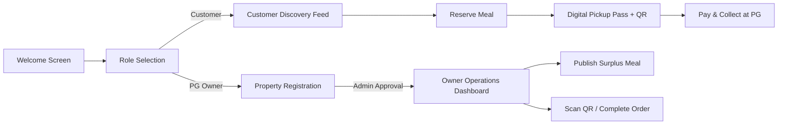

<p align="center">
  
</p>

<h1 align="center">ExtraBite — Campus Food Rescue Platform</h1>

<p align="center">
  <strong>Rescuing surplus food from hostels, PGs, and messes to provide affordable meals for students and eliminate campus food waste.</strong>
</p>

<p align="center">
  
  
  
  
  
  
</p>

---

## 📖 Overview

Every day, university hostels, paying guest (PG) accommodations, and private mess facilities cook excess fresh meals that often go unconsumed. Meanwhile, students and nearby residents search for affordable, wholesome meal options.

**ExtraBite** bridges this gap through a hyperlocal, real-time food rescue network. PG owners list high-quality surplus meals at discounted prices (typically ₹20–₹50), and students reserve portions on their phones for quick, pay-at-counter collection.

---

## 🏛️ Monorepo Structure

The repository is organized as a unified monorepo containing both the cross-platform mobile application and the administrative web operations portal:

```
ExtraBite/
├── ExtraBiteMobile/               # Flutter Mobile App (Android & iOS)
│   ├── lib/
│   │   ├── app/                   # Routing (GoRouter), Theme, Design Tokens
│   │   ├── core/                  # AppConfig, Supabase Services, Repositories
│   │   ├── features/
│   │   │   ├── auth/              # Role selection, Login, Register, Forgot Password
│   │   │   ├── customer/          # Food discovery, Map/Feed, Detail, Pickup Pass
│   │   │   ├── owner/             # PG Dashboard, Meal listing, QR Scanner/Verification
│   │   │   └── common/            # Shared UI components, badges, stat cards
│   │   ├── models/                # UserModel, FoodListing, Reservation, PG Profile
│   │   ├── providers/             # StateNotifier & Riverpod state layers
│   │   └── main.dart              # Mobile App Entrypoint
│   └── test/                      # 57 automated unit, widget, and navigation tests
│
├── ExtraBiteAdmin/                # Flutter Web Operations Console
│   ├── lib/
│   │   ├── app/                   # Web Router & Theme
│   │   ├── core/                  # Admin API Repositories & Supabase Config
│   │   ├── features/
│   │   │   ├── auth/              # Admin Login Gate
│   │   │   └── dashboard/         # 8 Operation Tabs (Verification, Food, Users, etc.)
│   │   └── main.dart              # Web App Entrypoint
│   └── test/                      # 12 automated integration tests
│
└── supabase/                      # Database Architecture & SQL Migrations
    └── schema.sql                 # PostgreSQL tables, RLS policies, indexes, RPCs
```

---

## ⚡ Key Architectural Features & Business Rules

### 1. 🚫 Pay-At-Pickup Guarantee (Zero Gateway Fees)
* ExtraBite is strictly a **reservation and pay-at-pickup** platform.
* No online payment gateway overhead, transaction fees, or digital payment friction.
* Reservations record `amount_to_collect`, and customers pay the host in cash or direct UPI at collection time.

### 2. 📍 Hyperlocal Haversine GPS Discovery
* Computes exact distance using the Haversine formula against live device coordinates.
* Interactive radius filters: **1 km**, **2 km (Default)**, **5 km**, and **10 km**.
* Location picker bottom sheet allows users to test or change target campus areas seamlessly.

### 3. 🛡️ Portion & Expiry Protection
* Prevents overselling with database-level atomic reservation handling (`reserve_food` RPC).
* Visual countdown timers highlight meals ending in under 90 minutes.
* Auto-expires listings past their pickup window.

### 4. 🎫 Secure Digital Pickup Pass & QR Verification
* Generates an interactive ticket with a scannable **QR code** and a 4-character **Pickup Code** (e.g., `#A9F2`).
* PG Owners verify student collection in real time using the built-in QR scanner modal or manual code entry.

### 5. 👥 Role-Based Onboarding & Moderation
* **Customer Role**: Immediate access to food discovery and reservation tools.
* **PG Owner Role**: Requires property profile registration (FSSAI, address, coordinates) and explicit Admin moderation approval (`is_owner_eligible`).
* **Admin Role**: Full moderation authority to approve/reject PGs, toggle food listings, resolve safety incident reports, and manage accounts.

---

## 🎯 User Journeys & Portals



### 👤 Customer App
* **Feed & Search**: Filter by meal category (Breakfast, Lunch, Dinner), Dietary type (Veg / Non-Veg), Price (< ₹30), and Distance.
* **Meal Details**: View portion count, host PG name, address, pickup time window, and food preparation notes.
* **Active Reservations**: Live reservation status card with 1-tap navigation to the digital pickup pass.
* **Trust & Safety**: Integrated 1-to-5 star rating and food safety incident reporting.

### 🏠 PG Owner App
* **Dashboard Stats**: Real-time overview of active listings, pending pickups, completed rescues, and total earnings.
* **Add Surplus Meal**: Form with automatic price calculation, portion limits, dietary tags, and time window validation.
* **Order Management**: Real-time list of customer reservations with live status indicators.
* **Pickup Verification**: Instant QR code scanning with camera or manual 4-character pickup code entry.

### 💻 Admin Web Operations Console
* **Overview Tab**: Live KPI summary (total users, verified PGs, active meals, meals rescued, CO₂ offset in kg).
* **PG Verification**: Inspection queue for pending PG properties with FSSAI document review, address verification, and 1-click Approve / Reject with custom feedback.
* **Food Listings Moderation**: Real-time feed of all active surplus meals with instant visibility toggle.
* **Live Orders Feed**: End-to-end monitoring of all active and completed reservations across all properties.
* **User Management**: Searchable user directory with role badges and account suspension controls.
* **Safety & Reports**: Dispute and safety report triage center with resolution logging.

---

## 🛠️ Tech Stack

| Domain | Technology |
|---|---|
| **Framework** | Flutter 3.24+ (Dart 3.5+) |
| **State Management** | Flutter Riverpod (`flutter_riverpod: ^2.5.1`) |
| **Routing** | GoRouter (`go_router: ^14.2.0`) with declarative redirect guards |
| **Backend & Database** | Supabase (`supabase_flutter: ^2.8.0`) — PostgreSQL 15, Auth, Storage, Realtime |
| **Geolocation** | `geolocator: ^13.0.2` |
| **QR Code & Scanning** | `qr_flutter: ^4.1.0`, `mobile_scanner: ^6.0.4` |
| **Typography & Theme** | Google Fonts (Plus Jakarta Sans & Inter), Tailored Modern Design System |
| **Testing** | Flutter Test framework with mock repositories and headless widget testers |

---

## 🚀 Getting Started

### Prerequisites
* [Flutter SDK (v3.24 or newer)](https://docs.flutter.dev/get-started/install)
* [Android Studio](https://developer.android.com/studio) or VS Code with Flutter Extension
* Google Chrome (for Admin Web)
* An active [Supabase](https://supabase.com) project

---

### Installation & Setup

1. **Clone the repository**:
   ```bash
   git clone https://github.com/NitheshK4/ExtraBite.git
   cd ExtraBite
   ```

2. **Configure Environment Variables**:
   Copy the `.env.example` templates into `.env.local`:
   ```bash
   # In ExtraBiteMobile
   cp ExtraBiteMobile/.env.example ExtraBiteMobile/.env.local

   # In ExtraBiteAdmin
   cp ExtraBiteAdmin/.env.example ExtraBiteAdmin/.env.local
   ```

   Fill in your Supabase credentials:
   ```env
   SUPABASE_URL=https://epcurxrrnbqqwifrcrjz.supabase.co
   SUPABASE_ANON_KEY=your-publishable-anon-key
   ```

---

### Running ExtraBite Mobile

```bash
cd ExtraBiteMobile

# 1. Fetch dependencies
flutter pub get

# 2. Run static analysis
flutter analyze

# 3. Execute automated test suite
flutter test

# 4. Launch on connected device or emulator
flutter run
```

#### Building Release APK:
```bash
flutter build apk --release
# Output: build/app/outputs/flutter-apk/app-release.apk
```

---

### Running ExtraBite Admin Web

```bash
cd ExtraBiteAdmin

# 1. Fetch dependencies
flutter pub get

# 2. Run static analysis
flutter analyze

# 3. Execute web test suite
flutter test

# 4. Launch on Chrome
flutter run -d chrome
```

#### Building Release Web App:
```bash
flutter build web --release
# Output: build/web
```

---

## 🧪 Testing & Quality Assurance

Both projects enforce rigorous test coverage:

```bash
# Test Mobile (57 tests)
cd ExtraBiteMobile && flutter test

# Test Admin Web (12 tests)
cd ExtraBiteAdmin && flutter test
```

### Test Coverage Highlights:
- **Authentication & User Data Isolation**: Role isolation, session state transitions, token expiration handling.
- **Location & Haversine Distance**: Coordinate distance calculations, radius filtering, fallback area handling.
- **Marketplace & Portion Protection**: Zero-portion reservation prevention, sold-out status updates, duplicate booking prevention.
- **Admin Moderation & RLS**: PG verification approvals/rejections, listing moderation toggles, suspension enforcement.

---

## 🔒 Security & Privacy

* **Zero Secret Keys in Client**: Client apps only bundle public publishable keys (`anon_key`).
* **Row-Level Security (RLS)**: Enforced directly at the PostgreSQL layer for all tables (`profiles`, `pg_profiles`, `food_listings`, `reservations`, `safety_reports`).
* **Role Validation Guards**: Administrative and PG Owner endpoints strictly verify claims before executing operations.

---

## 📄 License

This project is licensed under the **MIT License**. See the [LICENSE](LICENSE) file for details.
